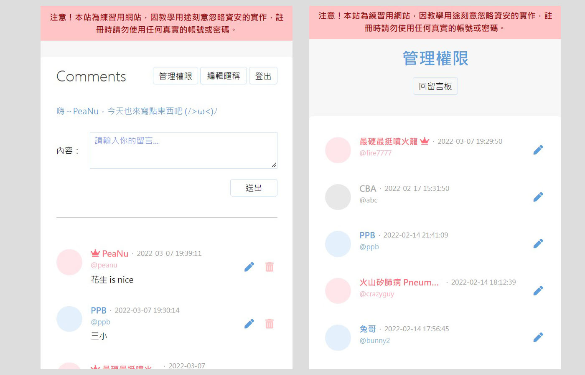

# 留言板

連結：http://peanu.tw/message-board/index.php

## 這是什麼？

一個用 PHP 做出來的簡易留言板。主要的功能有：

- 登入機制
- 註冊機制
- 分頁功能
- 權限機制（管理員、一般會員、停權用戶）
- 管理權限機制（管理員才可以）

## 資訊安全措施

- 防止 XSS 攻擊
- 防止 SQL Injection
- 密碼先 hash 後才存到資料庫
- 權限管理（不可以刪除、編輯別人的留言）

## 網站預覽

